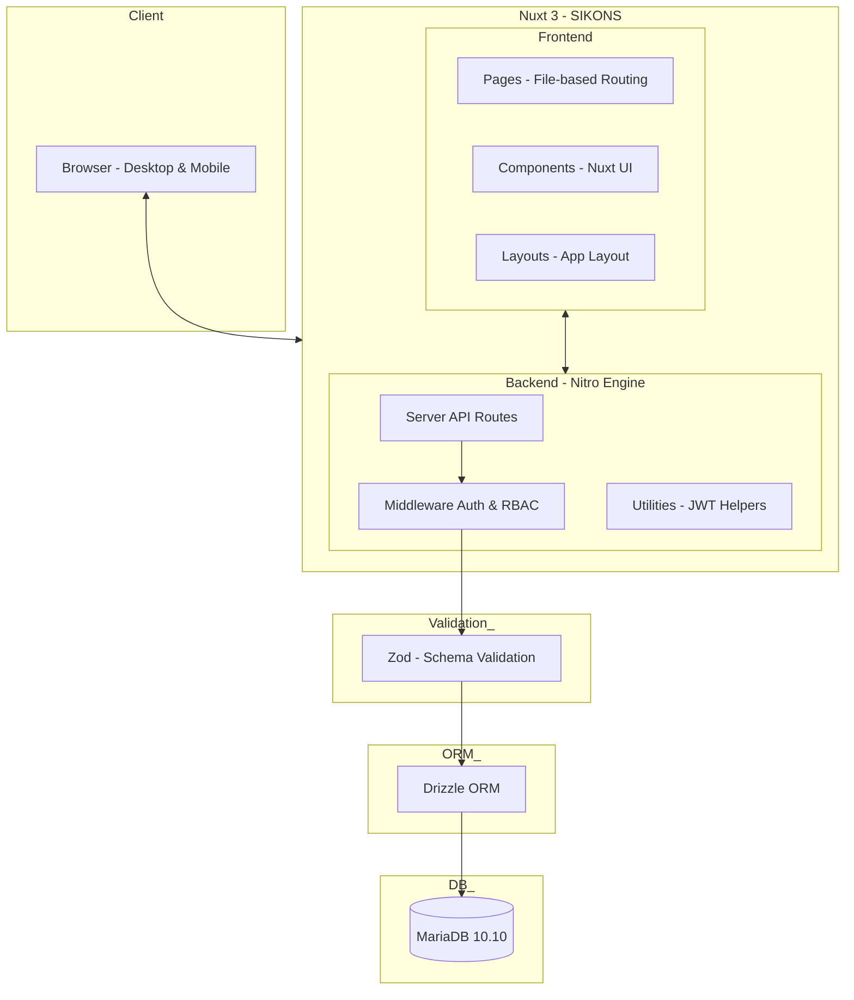
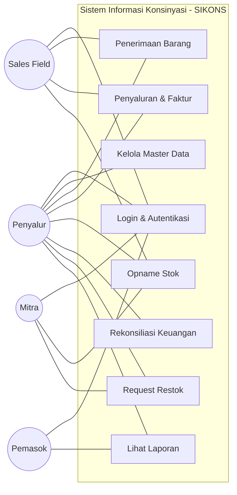
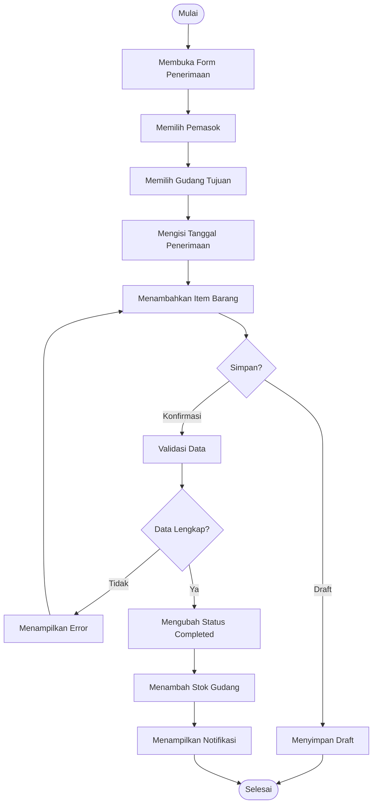
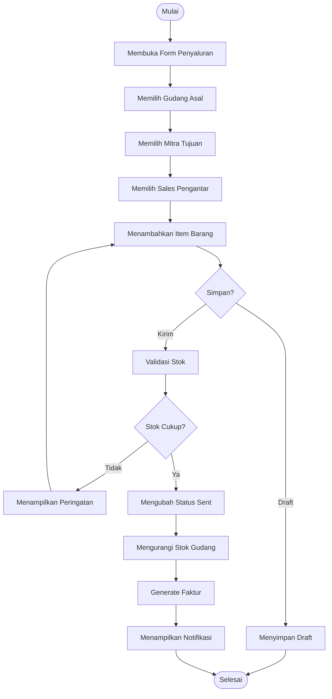
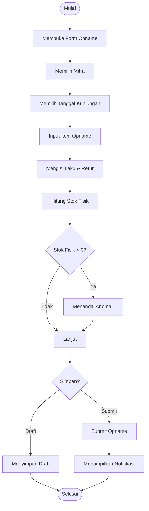
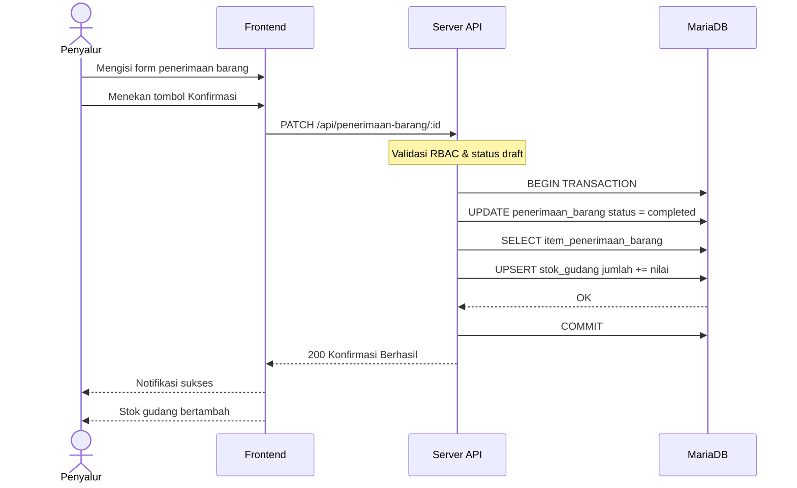
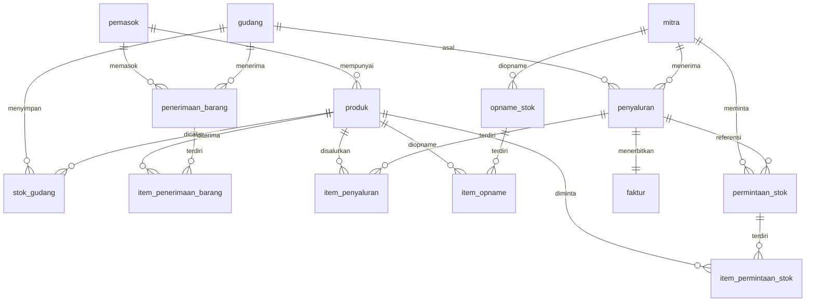

# BAB 3 — METODE PENELITIAN

---

## 3.1 Bahan/Data

Penelitian ini menggunakan dua jenis data yang dikelompokkan berdasarkan fungsinya, yaitu data primer dan data sekunder.

Data primer diperoleh melalui observasi langsung dan wawancara dengan pihak terkait di perusahaan distribusi yang menjadi objek penelitian. Observasi dilakukan terhadap alur bisnis konsinyasi yang sedang berjalan, mulai dari proses penerimaan barang dari pemasok, pencatatan stok gudang, distribusi barang ke mitra, pencatatan penjualan dan retur, hingga rekonsiliasi keuangan. Wawancara dilakukan dengan penyalur, sales lapangan, dan pemilik mitra untuk menggali kebutuhan sistem dan kendala yang dihadapi dalam pencatatan manual.

Data sekunder berupa dokumen-dokumen pendukung yang digunakan untuk memvalidasi kebutuhan sistem, meliputi:
1. Dokumen transaksi penerimaan barang (surat jalan pemasok, faktur pembelian);
2. Dokumen penyaluran barang ke mitra (faktur titip jual, delivery order);
3. Laporan opname stok dan rekap penjualan;
4. Format rekonsiliasi keuangan yang digunakan saat ini.

Data sekunder ini berfungsi sebagai acuan dalam merancang struktur data, format dokumen, serta alur kerja sistem yang sesuai dengan praktik bisnis di lapangan.

---

## 3.2 Peralatan

Peralatan yang digunakan dalam penelitian ini terdiri dari perangkat keras (hardware) dan perangkat lunak (software) yang mendukung proses pengembangan, implementasi, dan pengujian sistem.

### 3.2.1 Perangkat Keras

| No | Perangkat | Spesifikasi | Fungsi |
|:---|:----------|:------------|:-------|
| 1 | Laptop pengembangan | ASUS VivoBook E410MA, Intel Celeron N4020 @1,1 GHz, RAM 4 GB, penyimpanan internal 256 GB | Tempat pengembangan aplikasi, penulisan kode, dan pengujian lokal |
| 2 | Server Docker | Kontainer Docker pada mesin yang sama | Menjalankan basis data MariaDB dalam lingkungan terisolasi |
| 3 | Perangkat mobile | Smartphone layar 6 inci (360px+) | Pengujian tampilan responsif pada perangkat mobile |

### 3.2.2 Perangkat Lunak

| No | Perangkat Lunak | Versi | Fungsi |
|:---|:----------------|:------|:-------|
| 1 | Windows/Linux | — | Sistem operasi tempat pengembangan berjalan |
| 2 | Visual Studio Code | 1.x | Editor kode sumber untuk penulisan seluruh kode program |
| 3 | Node.js | 20.x | Runtime JavaScript untuk menjalankan Nuxt 3 di sisi server |
| 4 | pnpm | 10.x | Package manager untuk manajemen dependensi proyek |
| 5 | Nuxt 3 | ^3.16 | Framework utama pengembangan aplikasi web monolitik |
| 6 | TypeScript | 5.x | Bahasa pemrograman dengan static typing untuk menjamin type-safety |
| 7 | MariaDB | 10.10 | Sistem manajemen basis data relasional untuk penyimpanan data |
| 8 | Drizzle ORM | ^0.40 | Object-Relational Mapping untuk interaksi basis data berbasis TypeScript |
| 9 | Docker Desktop | 4.x | Platform kontainerisasi untuk menjalankan MariaDB |
| 10 | Google Chrome | 120+ | Peramban untuk pengujian antarmuka dan debugging |
| 11 | Nuxt UI | ^2.x | Pustaka komponen Vue 3 berbasis Tailwind CSS untuk antarmuka |
| 12 | Zod | ^3.24 | Pustaka validasi data untuk memvalidasi input pada klien dan server |
| 13 | html2pdf.js | — | Pustaka JavaScript untuk mencetak faktur dan dokumen ke PDF |

---

## 3.3 Prosedur Penelitian

Prosedur penelitian ini mengikuti metodode Waterfall yang terdiri dari lima tahap: analisis kebutuhan, desain sistem, implementasi, pengujian, dan pemeliharaan (Pressman, 2015).

### 3.3.1 Analisis Kebutuhan

Pada tahap ini dilakukan analisis terhadap sistem yang sedang berjalan (sistem manual) untuk mengidentifikasi masalah, kelemahan, dan kebutuhan pengguna. Teknik pengumpulan data yang digunakan meliputi:

1. **Observasi**: Pengamatan langsung terhadap proses bisnis konsinyasi di perusahaan distribusi, mencakup alur penerimaan barang, pencatatan stok, distribusi ke mitra, opname stok, dan rekonsiliasi keuangan.
2. **Wawancara**: Tanya jawab dengan penyalur, sales lapangan, dan pemilik mitra untuk memahami kebutuhan fungsional dan kendala operasional.
3. **Studi Pustaka**: Kajian terhadap literatur dan penelitian terdahulu yang relevan dengan sistem informasi konsinyasi, framework Nuxt 3, basis data MariaDB, dan metode pengujian perangkat lunak.

Hasil analisis kebutuhan dirumuskan dalam bentuk spesifikasi kebutuhan fungsional dan non-fungsional sistem yang menjadi acuan dalam tahap desain.

### 3.3.2 Desain Sistem

Tahap desain sistem meliputi perancangan arsitektur sistem, pemodelan proses menggunakan Unified Modeling Language (UML), perancangan basis data, dan perancangan antarmuka pengguna. UML digunakan untuk memvisualisasikan, menspesifikasikan, dan mendokumentasikan artefak sistem melalui use case diagram, activity diagram, dan sequence diagram (Booch et al., 2005). Perancangan basis data dilakukan dengan membuat Entity Relationship Diagram (ERD) dan skema tabel relasional menggunakan Drizzle ORM.

### 3.3.3 Implementasi

Implementasi dilakukan dengan menerjemahkan desain sistem menjadi kode program menggunakan framework Nuxt 3, TypeScript, Tailwind CSS, dan Nuxt UI. Basis data diimplementasikan menggunakan MariaDB dengan Drizzle ORM sebagai jembatan antara kode aplikasi dan basis data. Setiap modul dikembangkan secara bertahap sesuai urutan prioritas: Master Data, Penerimaan Barang, Penyaluran dan Faktur, Opname Stok, Rekonsiliasi Keuangan, dan Request Restock.

### 3.3.4 Pengujian Sistem

Pengujian sistem dilakukan dengan pendekatan pengujian fungsional yang berfokus pada validasi alur kerja sistem berdasarkan skenario penggunaan nyata. Setiap skenario uji mencakup langkah-langkah operasional, data masukan, hasil yang diharapkan, dan kriteria kelulusan. Dokumentasi pengujian dilakukan melalui tangkapan layar (screenshot) yang menunjukkan hasil eksekusi setiap skenario. Cakupan pengujian meliputi:

1. Operasi CRUD pada setiap modul;
2. Validasi alur kerja status (draft, completed, sent, received, submitted, verified);
3. Perhitungan otomatis (stok fisik, total faktur, pendapatan mitra dan penyalur);
4. Deteksi anomali stok pada opname;
5. Pembatasan akses berdasarkan peran pengguna (RBAC).

### 3.3.5 Pemeliharaan

Tahap pemeliharaan dilakukan setelah sistem diimplementasikan dan diuji. Pada tahap ini dilakukan perbaikan jika ditemukan kesalahan, penyesuaian terhadap perubahan kebutuhan, serta dokumentasi teknis untuk pengembangan selanjutnya.

---

## 3.4 Analisis dan Rancangan Sistem

### 3.4.1 Analisis Sistem

**Sistem yang Berjalan**

Sistem pencatatan konsinyasi yang berjalan saat ini dilakukan secara manual menggunakan buku catatan dan spreadsheet. Alur bisnis dimulai ketika penyalur menerima barang dari pemasok dan mencatatnya dalam buku penerimaan barang. Barang yang diterima kemudian didistribusikan ke mitra-mitra dengan delivery order manual. Sales lapangan mengunjungi mitra secara periodik untuk mencatat jumlah barang laku dan retur dalam buku kunjungan. Rekonsiliasi keuangan dilakukan di akhir periode dengan merekap data dari berbagai catatan manual, yang sering kali menyebabkan keterlambatan dan ketidakakuratan perhitungan.

Permasalahan utama yang teridentifikasi pada sistem manual meliputi:
1. Risiko kehilangan atau kerusakan catatan fisik;
2. Ketidakmampuan memantau stok secara real-time di gudang dan mitra;
3. Kesalahan perhitungan rekonsiliasi keuangan karena rekap manual;
4. Tidak adanya kontrol akses berbasis peran;
5. Keterlambatan pengambilan keputusan karena data tidak tersedia secara cepat.

**Sistem yang Diusulkan**

Sistem yang diusulkan adalah Sistem Informasi Konsinyasi (SIKONS) berbasis web yang mengintegrasikan seluruh alur bisnis konsinyasi dalam satu platform. Sistem mencakup enam modul utama yang saling terhubung: Master Data, Penerimaan Barang, Penyaluran dan Faktur, Opname Stok, Rekonsiliasi Keuangan, dan Request Restock. Setiap modul memiliki alur kerja (workflow) dengan status yang jelas, sehingga data hanya berubah pada kondisi yang telah ditentukan. Sistem juga menerapkan Role-Based Access Control (RBAC) untuk empat peran pengguna: Penyalur, Sales Field, Mitra, dan Pemasok.

Perbandingan antara sistem berjalan dan sistem usulan disajikan dalam tabel berikut.

| Aspek | Sistem Berjalan | Sistem Usulan (SIKONS) |
|:------|:----------------|:----------------------|
| Pencatatan | Manual (buku/spreadsheet) | Digital (basis data relasional) |
| Stok Gudang | Tidak diketahui real-time | Terpantau real-time |
| Faktur | Buat manual | Auto-generate |
| Rekonsiliasi | Rekap manual, rawan salah | Otomatis, three-tier pricing |
| Kontrol Akses | Tidak ada | RBAC (4 peran) |
| Laporan | Tidak tersedia real-time | Dashboard & export |

### 3.4.2 Kebutuhan Sistem

**Kebutuhan Fungsional**

Berdasarkan hasil analisis, kebutuhan fungsional sistem dikelompokkan per modul sebagai berikut.

| Kode | Modul | Kebutuhan Fungsional | Aktor |
|:-----|:------|:---------------------|:------|
| F-01 | Autentikasi | Pengguna dapat login dan logout menggunakan email dan password | Semua pengguna |
| F-02 | Master Data | Pengguna dapat mengelola data pemasok (CRUD) | Penyalur |
| F-03 | Master Data | Pengguna dapat mengelola data produk dengan SKU unik dan tiga tingkat harga | Penyalur |
| F-04 | Master Data | Pengguna dapat mengelola data mitra dengan koordinat GPS dan penugasan sales | Penyalur |
| F-05 | Master Data | Pengguna dapat mengelola data gudang | Penyalur |
| F-06 | Master Data | Pengguna dapat mengelola data pengguna dengan empat peran | Penyalur |
| F-07 | Master Data | Pengguna dapat melihat stok gudang per produk secara real-time | Penyalur, Sales |
| F-08 | Penerimaan | Pengguna dapat mencatat penerimaan barang dari pemasok dengan workflow draft → completed | Penyalur |
| F-09 | Penerimaan | Sistem menambah stok gudang saat status berubah menjadi completed | Sistem |
| F-10 | Penyaluran | Pengguna dapat membuat penyaluran barang ke mitra dengan workflow draft → sent → received | Penyalur, Sales |
| F-11 | Penyaluran | Sistem mengurangi stok gudang saat status berubah menjadi sent | Sistem |
| F-12 | Faktur | Sistem otomatis menerbitkan faktur titip jual saat penyaluran dikirim | Sistem |
| F-13 | Opname | Pengguna dapat mencatat opname stok dengan input laku, retur, dan deteksi anomali | Penyalur, Sales, Mitra |
| F-14 | Opname | Sistem otomatis menghitung stok fisik dan mendeteksi anomali | Sistem |
| F-15 | Rekonsiliasi | Sistem menyediakan laporan rekonsiliasi penyalur dengan three-tier pricing | Penyalur |
| F-16 | Rekonsiliasi | Sistem menyediakan laporan rekonsiliasi mitra yang disederhanakan | Mitra |
| F-17 | Restock | Mitra dapat mengajukan permintaan restok | Mitra |
| F-18 | Restock | Penyalur dapat menyetujui atau menolak permintaan restok | Penyalur |
| F-19 | Restock | Sistem otomatis membuat draft penyaluran saat permintaan disetujui | Sistem |
| F-20 | Laporan | Pemasok dapat melihat laporan performa produknya | Pemasok |

**Kebutuhan Non-Fungsional**

| Kode | Kategori | Kebutuhan | Target |
|:-----|:---------|:----------|:-------|
| NF-01 | Performa | Waktu muat halaman utama kurang dari 2,5 detik pada koneksi 4G | LCP < 2,5 detik |
| NF-02 | Responsivitas | Tampilan berfungsi penuh pada layar 360px | Mobile-first |
| NF-03 | Keamanan | Autentikasi menggunakan JWT dengan token yang memiliki masa berlaku | JWT Access Token |
| NF-04 | Keamanan | Setiap akses ke API route diperiksa hak akses berdasarkan peran | RBAC Middleware |
| NF-05 | Keandalan | Transaksi multi-tabel menggunakan ACID transaction | COMMIT/ROLLBACK |
| NF-06 | Validasi | Semua input data divalidasi menggunakan Zod di sisi klien dan server | Zod Schema |

### 3.4.3 Rancangan Arsitektur Sistem

Arsitektur sistem SIKONS menggunakan pendekatan monolitik dengan pemisahan logis antara frontend dan backend dalam satu proyek Nuxt 3. Nuxt 3 menyediakan server-side rendering (SSR) untuk halaman-halaman tertentu serta RESTful API melalui server routes pada direktori `server/api/`. Komunikasi antara frontend dan backend dilakukan melalui HTTP Request yang difasilitasi oleh modul `ofetch` bawaan Nuxt.

Pada sisi frontend, halaman-halaman sistem menggunakan file-based routing pada direktori `pages/`, komponen reusable pada direktori `components/`, dan layout pada direktori `layouts/`. Antarmuka dibangun menggunakan Nuxt UI yang berbasis Tailwind CSS. Pada sisi backend, server API routes menangani logika bisnis dan validasi data menggunakan Zod. Autentikasi dan otorisasi diimplementasikan melalui middleware Nuxt yang memeriksa token JWT dan hak akses berdasarkan peran pengguna.

Interaksi dengan basis data dilakukan melalui Drizzle ORM yang menghubungkan kode TypeScript dengan MariaDB. Drizzle ORM mengelola migrasi skema, query builder, dan transaksi basis data. Basis data MariaDB berjalan dalam kontainer Docker untuk isolasi lingkungan.

Gambaran arsitektur sistem disajikan pada diagram berikut.

### 3.4.4 Rancangan Proses

Rancangan proses sistem dimodelkan menggunakan Unified Modeling Language (UML) yang meliputi use case diagram, activity diagram, dan sequence diagram.

**Use Case Diagram**

Use case diagram menggambarkan interaksi antara empat aktor (Penyalur, Sales Field, Mitra, dan Pemasok) dengan fungsionalitas sistem. Penyalur memiliki akses ke seluruh modul, Sales Field dapat mengakses modul Penerimaan Barang, Penyaluran, dan Opname Stok, Mitra dapat mengakses Opname Stok dan Request Restock, sedangkan Pemasok hanya dapat melihat laporan performa produk.

**Activity Diagram**

Activity diagram digunakan untuk memodelkan alur kerja setiap modul utama. Berikut adalah activity diagram untuk tiga modul inti: Penerimaan Barang, Penyaluran dan Faktur, serta Opname Stok.

*Activity Diagram — Penerimaan Barang*

Alur penerimaan barang dimulai dengan pengisian form, pemilihan pemasok dan gudang, penambahan item barang, dan diakhiri dengan konfirmasi (completed) yang memicu penambahan stok gudang.

*Activity Diagram — Penyaluran & Faktur*

Alur penyaluran dimulai dengan pembuatan form, pemilihan gudang asal, mitra tujuan, dan sales. Sistem melakukan validasi ketersediaan stok sebelum mengubah status menjadi sent, yang memicu pengurangan stok gudang dan pembuatan faktur secara otomatis.

*Activity Diagram — Opname Stok*

Alur opname stok dimulai dengan pemilihan mitra dan tanggal kunjungan. Sales menginput jumlah laku dan retur untuk setiap produk, kemudian sistem otomatis menghitung stok fisik dan mendeteksi anomali jika stok fisik bernilai negatif.

**Sequence Diagram**

Sequence diagram berikut menggambarkan interaksi antar objek pada proses konfirmasi penerimaan barang. Penyalur mengirim permintaan konfirmasi melalui frontend, server API memvalidasi data, menjalankan transaksi basis data secara atomik, dan mengembalikan respons.

### 3.4.5 Rancangan Data

Rancangan data sistem direpresentasikan dalam bentuk Entity Relationship Diagram (ERD) yang menggambarkan 15 tabel beserta relasi antar tabel. Berikut adalah penjelasan masing-masing tabel dan relasinya.

**Tabel dan Relasi**

| No | Tabel | Deskripsi | Relasi Utama |
|:---|:------|:-----------|:-------------|
| 1 | `pemasok` | Data pemasok/pabrikan | — |
| 2 | `produk` | Data produk dengan tiga tingkat harga | FK id_pemasok → pemasok.id |
| 3 | `gudang` | Data lokasi gudang | — |
| 4 | `mitra` | Data toko mitra pengecer | FK id_sales_ditugaskan → pengguna.id |
| 5 | `pengguna` | Data pengguna dengan empat peran | FK id_mitra → mitra.id, FK id_pemasok → pemasok.id |
| 6 | `stok_gudang` | Jumlah stok per produk per gudang | FK id_gudang → gudang.id, FK id_produk → produk.id |
| 7 | `penerimaan_barang` | Header penerimaan barang | FK id_pemasok, FK id_gudang, FK diterima_oleh |
| 8 | `item_penerimaan_barang` | Detail item penerimaan | FK id_penerimaan → penerimaan_barang.id, FK id_produk |
| 9 | `penyaluran` | Header penyaluran ke mitra | FK id_gudang_asal, FK id_mitra, FK id_sales, FK dibuat_oleh |
| 10 | `item_penyaluran` | Detail item penyaluran | FK id_penyaluran → penyaluran.id, FK id_produk |
| 11 | `faktur` | Faktur titip jual (one-to-one) | FK id_penyaluran → penyaluran.id |
| 12 | `opname_stok` | Header opname stok kunjungan | FK id_mitra, FK id_sales, FK dibuat_oleh |
| 13 | `item_opname` | Detail item opname | FK id_opname → opname_stok.id, FK id_produk |
| 14 | `permintaan_stok` | Header permintaan restok | FK id_mitra, FK diminta_oleh, FK disetujui_oleh, FK id_penyaluran |
| 15 | `item_permintaan_stok` | Detail item permintaan | FK id_permintaan → permintaan_stok.id, FK id_produk |

**Entity Relationship Diagram**

**Spesifikasi Tabel**

Berikut adalah detail struktur setiap tabel yang diimplementasikan menggunakan Drizzle ORM dengan basis data MariaDB.

1. **pengguna** — Menyimpan data pengguna sistem
   - `id` BIGINT PK auto_increment
   - `nama` VARCHAR(100) NOT NULL
   - `email` VARCHAR(150) UNIQUE NOT NULL
   - `password_hash` VARCHAR(255) NOT NULL
   - `peran` ENUM('penyalur','sales','mitra','pemasok') NOT NULL
   - `id_mitra` BIGINT FK → mitra.id (nullable)
   - `id_pemasok` BIGINT FK → pemasok.id (nullable)
   - `apakah_aktif` TINYINT DEFAULT 1

2. **pemasok** — Menyimpan data pemasok
   - `id` BIGINT PK
   - `nama` VARCHAR(100) NOT NULL
   - `kategori_merek` VARCHAR(100) (nullable)
   - `narahubung` VARCHAR(100) (nullable)
   - `apakah_aktif` TINYINT DEFAULT 1

3. **produk** — Menyimpan data produk
   - `id` BIGINT PK
   - `sku` VARCHAR(50) UNIQUE NOT NULL
   - `nama` VARCHAR(150) NOT NULL
   - `id_pemasok` BIGINT FK NOT NULL
   - `satuan` VARCHAR(20) NOT NULL
   - `harga_pabrik` DECIMAL(12,2) NOT NULL
   - `harga_grosir` DECIMAL(12,2) NOT NULL
   - `harga_retail` DECIMAL(12,2) NOT NULL
   - `gambar` TEXT (nullable)
   - `apakah_aktif` TINYINT DEFAULT 1

4. **gudang** — Menyimpan data gudang
   - `id` BIGINT PK
   - `kode` VARCHAR(20) UNIQUE NOT NULL
   - `nama` VARCHAR(100) NOT NULL
   - `alamat` TEXT (nullable)
   - `apakah_aktif` TINYINT DEFAULT 1

5. **mitra** — Menyimpan data mitra
   - `id` BIGINT PK
   - `nama` VARCHAR(100) NOT NULL
   - `nama_pemilik` VARCHAR(100) NOT NULL
   - `telepon` VARCHAR(20) (nullable)
   - `alamat` VARCHAR(255) (nullable)
   - `lat` DECIMAL(10,8) (nullable)
   - `lng` DECIMAL(11,8) (nullable)
   - `id_sales_ditugaskan` BIGINT FK (nullable)
   - `apakah_aktif` TINYINT DEFAULT 1

6. **stok_gudang** — Menyimpan stok per produk per gudang
   - `id` BIGINT PK
   - `id_gudang` BIGINT FK NOT NULL
   - `id_produk` BIGINT FK NOT NULL
   - `jumlah` INT NOT NULL DEFAULT 0
   - `diperbarui_pada` TIMESTAMP

7. **penerimaan_barang** — Header penerimaan barang
   - `id` BIGINT PK
   - `nomor_penerimaan` VARCHAR(50) UNIQUE NOT NULL
   - `id_pemasok` BIGINT FK NOT NULL
   - `id_gudang` BIGINT FK NOT NULL
   - `diterima_oleh` BIGINT FK NOT NULL
   - `tanggal_penerimaan` DATE NOT NULL
   - `status` ENUM('draft','completed') DEFAULT 'draft'

8. **item_penerimaan_barang** — Detail item penerimaan
   - `id` BIGINT PK
   - `id_penerimaan` BIGINT FK NOT NULL
   - `id_produk` BIGINT FK NOT NULL
   - `jumlah` INT NOT NULL
   - `harga_pabrik_aktual` DECIMAL(12,2) NOT NULL

9. **penyaluran** — Header penyaluran ke mitra
   - `id` BIGINT PK
   - `nomor_penyaluran` VARCHAR(50) UNIQUE NOT NULL
   - `id_gudang_asal` BIGINT FK NOT NULL
   - `id_mitra` BIGINT FK NOT NULL
   - `id_sales` BIGINT FK NOT NULL
   - `tanggal_penyaluran` DATE NOT NULL
   - `status` ENUM('draft','sent','received') DEFAULT 'draft'
   - `dibuat_oleh` BIGINT FK NOT NULL

10. **item_penyaluran** — Detail item penyaluran
    - `id` BIGINT PK
    - `id_penyaluran` BIGINT FK NOT NULL
    - `id_produk` BIGINT FK NOT NULL
    - `jumlah_dikirim` INT NOT NULL
    - `snapshot_harga_retail` DECIMAL(12,2) NOT NULL
    - `snapshot_harga_grosir` DECIMAL(12,2) NOT NULL

11. **faktur** — Faktur titip jual
    - `id` BIGINT PK
    - `nomor_faktur` VARCHAR(50) UNIQUE NOT NULL
    - `id_penyaluran` BIGINT FK NOT NULL
    - `total_nilai` DECIMAL(14,2) NOT NULL
    - `diterbitkan_pada` TIMESTAMP
    - `url_pdf` VARCHAR(255) (nullable)

12. **opname_stok** — Header opname stok
    - `id` BIGINT PK
    - `nomor_opname` VARCHAR(50) UNIQUE NOT NULL
    - `id_mitra` BIGINT FK NOT NULL
    - `id_sales` BIGINT FK NOT NULL
    - `tanggal_kunjungan` DATE NOT NULL
    - `status` ENUM('draft','submitted','verified') DEFAULT 'draft'
    - `memiliki_anomali` TINYINT DEFAULT 0
    - `dibuat_oleh` BIGINT FK NOT NULL

13. **item_opname** — Detail item opname
    - `id` BIGINT PK
    - `id_opname` BIGINT FK NOT NULL
    - `id_produk` BIGINT FK NOT NULL
    - `stok_awal` INT NOT NULL
    - `jumlah_laku` INT NOT NULL
    - `jumlah_retur` INT NOT NULL
    - `hilang` INT DEFAULT 0
    - `penanggung_hilang` ENUM('penyalur','mitra') DEFAULT 'penyalur'
    - `stok_fisik` INT NOT NULL
    - `kondisi_retur` ENUM('good','damaged','expired') (nullable)
    - `apakah_anomali` TINYINT DEFAULT 0

14. **permintaan_stok** — Header permintaan restok
    - `id` BIGINT PK
    - `nomor_permintaan` VARCHAR(50) UNIQUE NOT NULL
    - `id_mitra` BIGINT FK NOT NULL
    - `diminta_oleh` BIGINT FK NOT NULL
    - `status` ENUM('pending','approved','rejected','fulfilled') DEFAULT 'pending'
    - `disetujui_oleh` BIGINT FK (nullable)
    - `id_penyaluran` BIGINT FK (nullable)

15. **item_permintaan_stok** — Detail item permintaan
    - `id` BIGINT PK
    - `id_permintaan` BIGINT FK NOT NULL
    - `id_produk` BIGINT FK NOT NULL
    - `jumlah_diminta` INT NOT NULL
    - `jumlah_disetujui` INT (nullable)

### 3.4.6 Rancangan Antarmuka

Rancangan antarmuka sistem dirancang dengan pendekatan mobile-first menggunakan Nuxt UI dan Tailwind CSS. Antarmuka terdiri dari layout utama dengan sidebar navigasi dan topbar yang menampilkan informasi pengguna. Setiap modul memiliki halaman daftar (index), halaman detail, halaman form input, dan halaman cetak dokumen.

Komponen antarmuka utama meliputi:
1. **Sidebar Navigasi**: Menu navigasi yang menampilkan modul-modul sistem berdasarkan peran pengguna yang sedang login.
2. **DataTable**: Tabel data dengan fitur pencarian, filter, dan sorting yang menggunakan komponen `UTable` dari Nuxt UI.
3. **Form Input**: Formulir input data dengan validasi real-time menggunakan Zod dan komponen `UForm` dari Nuxt UI.
4. **Modal Dialog**: Konfirmasi aksi menggunakan komponen `UModal` dari Nuxt UI.
5. **Notifikasi Toast**: Pemberitahuan keberhasilan atau kegagalan operasi menggunakan `useToast` dari Nuxt UI.
6. **Print View**: Halaman cetak untuk faktur dan surat jalan yang diformat khusus untuk pencetakan A4.

---

## Daftar Pustaka

Booch, G., Rumbaugh, J., & Jacobson, I. (2005). *The unified modeling language user guide* (2nd ed.). Addison-Wesley.

Connolly, T., & Begg, C. (2015). *Database systems: A practical approach to design, implementation, and management* (6th ed.). Pearson.

Fowler, M. (2004). *UML distilled: A brief guide to the standard object modeling language* (3rd ed.). Addison-Wesley.

Pressman, R. S. (2015). *Software engineering: A practitioner's approach* (8th ed.). McGraw-Hill.

Sommerville, I. (2016). *Software engineering* (10th ed.). Pearson.
