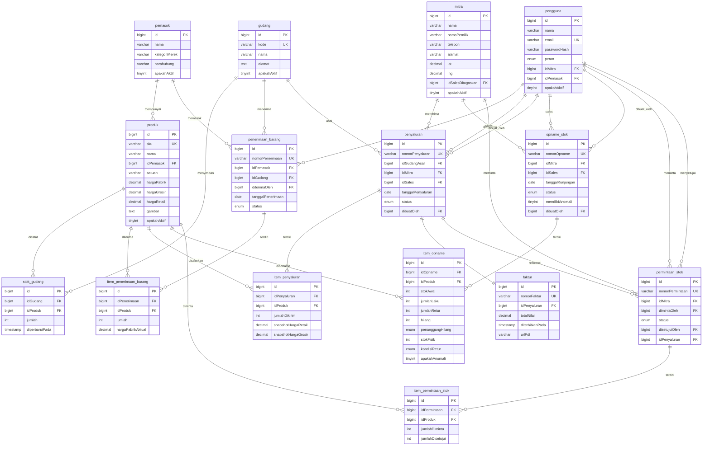
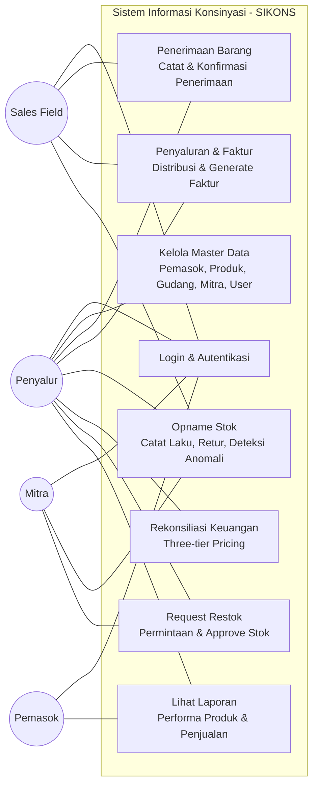
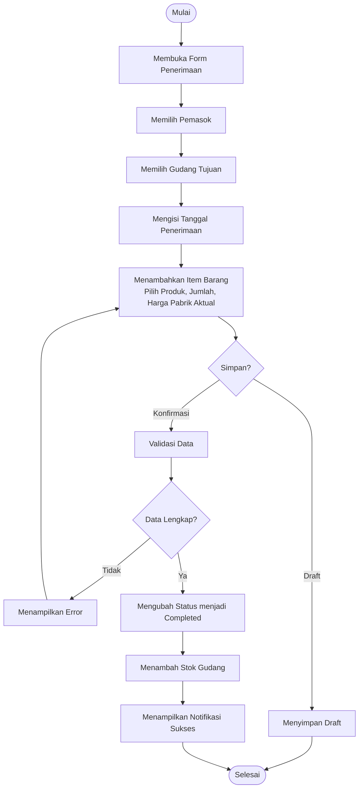
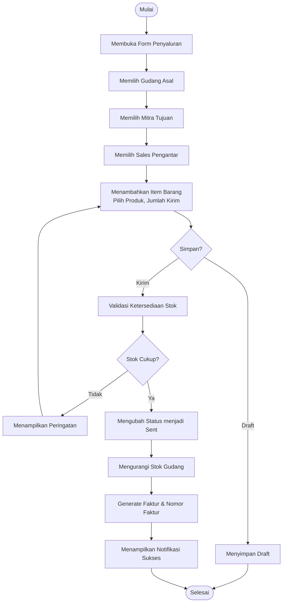
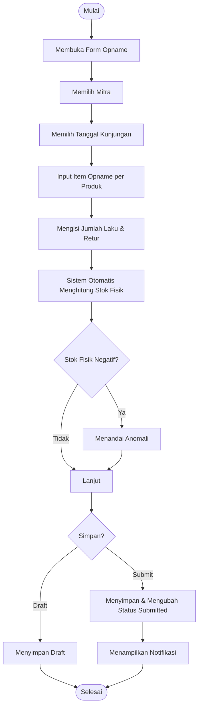
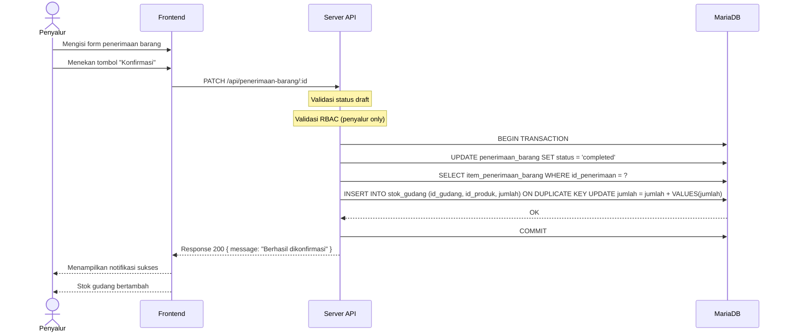
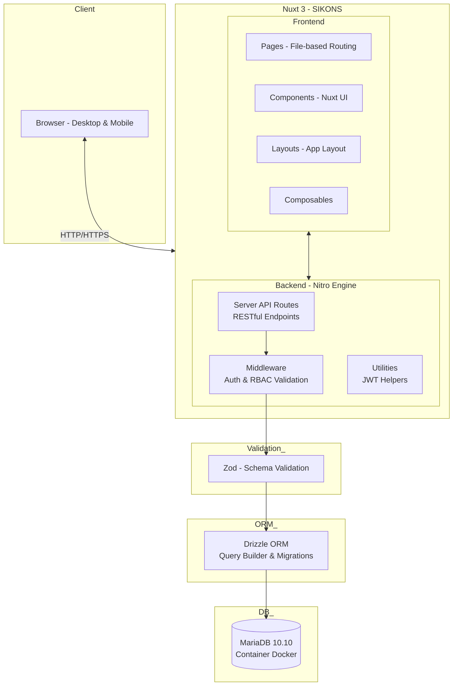

# Kumpulan Diagram Mermaid — SIKONS

> File ini berisi kode Mermaid untuk semua diagram yang digunakan di Bab 3.
> Copy-paste kode di antara blok ` ```mermaid ` ke tools seperti:
> - **Online:** https://mermaid.live
> - **VS Code extension:** Markdown Preview Mermaid Support
> - **GitHub:** paste langsung di file `.md` — akan dirender otomatis

---

## 1. ERD — Entity Relationship Diagram



---

## 2. Class Diagram


---

## 3. Use Case Diagram



---

## 4. Activity Diagram — Penerimaan Barang



---

## 5. Activity Diagram — Penyaluran & Faktur



---

## 6. Activity Diagram — Opname Stok



---

## 7. Sequence Diagram — Konfirmasi Penerimaan Barang



---

## 8. Arsitektur Sistem


