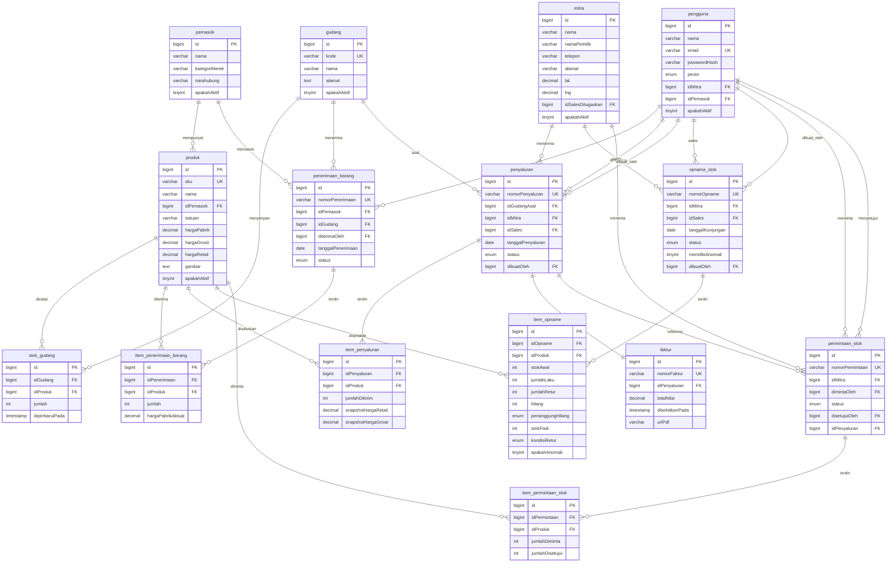
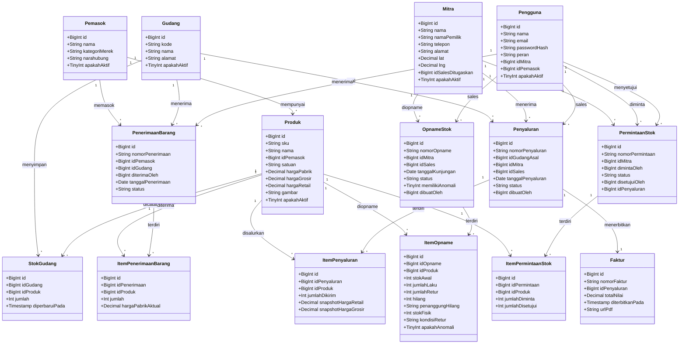
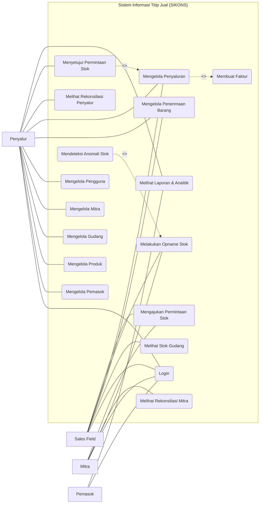
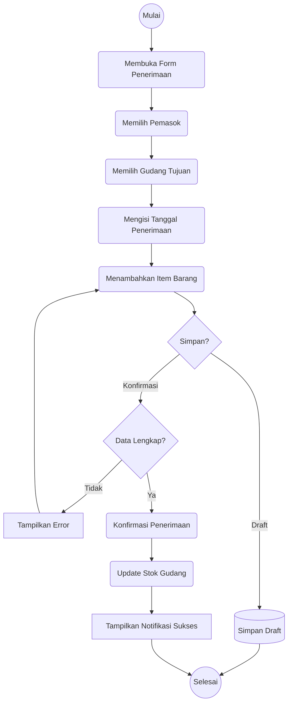
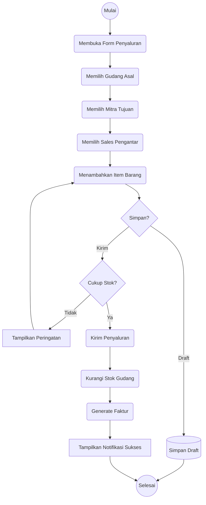
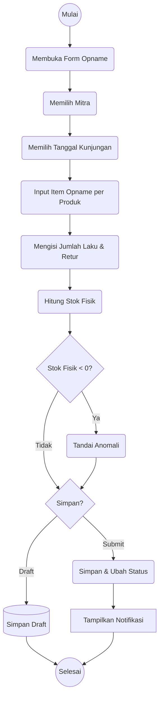
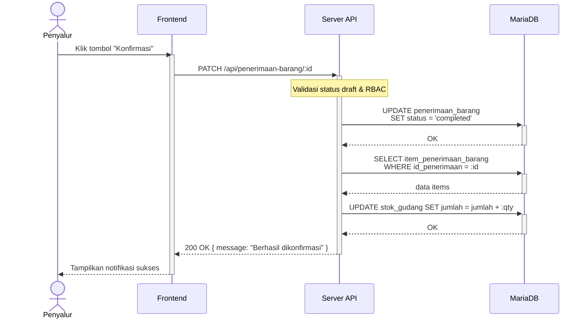
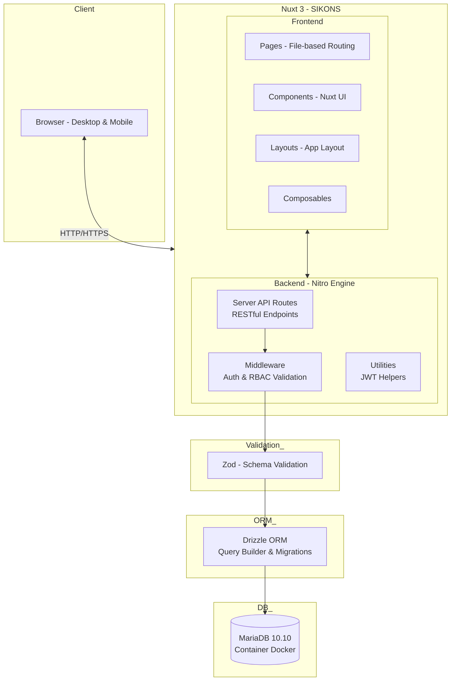

# Kumpulan Diagram Mermaid — SIKONS

> File ini berisi kode Mermaid untuk semua diagram yang digunakan di Bab 3.
> Copy-paste kode di antara blok ` ```mermaid ` ke tools seperti:
> - **Online:** https://mermaid.live
> - **VS Code extension:** Markdown Preview Mermaid Support
> - **GitHub:** paste langsung di file `.md` — akan dirender otomatis

---

## 1. ERD — Entity Relationship Diagram



---

## 2. Class Diagram



---

## 3. Use Case Diagram

> **UML Use Case Diagram** — `[Aktor]` persegi di luar batas sistem, `(Use Case)` oval di dalam `subgraph` (system boundary).
> Garis putus `-. <<include>> .->` untuk relasi <<include>> dan <<extend>> (standar UML).



---

## 4. Activity Diagram — Penerimaan Barang

> **UML Activity Diagram** — Initial node `((Mulai))`, action node `(Aksi)`, decision `{Pertanyaan}`,
> final node `((Selesai))`. Aliran digambarkan dengan panah `-->`.



---

## 5. Activity Diagram — Penyaluran & Faktur



---

## 6. Activity Diagram — Opname Stok



---

## 7. Sequence Diagram — Konfirmasi Penerimaan Barang

> **UML Sequence Diagram** — `activate`/`deactivate` untuk activation bar pada lifeline.
> `->>+` synchronous call (mengaktifkan target), `-->>-` return response (menonaktifkan target).



---

## 8. Arsitektur Sistem


