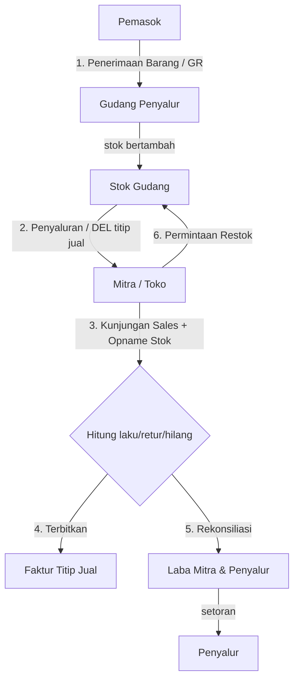

# 02 — Arsitektur

## Arsitektur Umum

SITJ dibangun sebagai aplikasi **full-stack** dengan framework **Nuxt 3** yang menggabungkan frontend (Vue 3) dan backend (Nitro server) dalam satu kode.

```
┌──────────────────────────────────────────────────────────────┐
│                        Browser (Klien)                       │
│   Vue 3 + Nuxt UI + Tailwind CSS  ·  cookie: sikons_auth     │
└───────────────────────────────┬──────────────────────────────┘
                                │ HTTP (SSR + $fetch ke /api/*)
                                ▼
┌──────────────────────────────────────────────────────────────┐
│              Nuxt 3 (Nitro Server)  — satu aplikasi          │
│                                                              │
│  ┌────────────┐  ┌─────────────────────────┐  ┌───────────┐  │
│  │  Frontend  │  │  server/api/*  (REST)   │  │  server/  │  │
│  │  pages/    │  │  server/middleware/auth │  │  database │  │
│  │  components│  │  server/utils (auth,    │  │  (Drizzle │  │
│  │  layouts/  │  │  rbac, database)        │  │  schema)  │  │
│  └────────────┘  └────────────┬────────────┘  └─────┬─────┘
│                               │                      │
└───────────────────────────────┼──────────────────────┼────────┘
                                │                      │
                                ▼                      ▼
                     ┌─────────────────┐     ┌─────────────────┐
                     │  MariaDB 10.10  │◀────│  Drizzle ORM    │
                     │  (MySQL)        │     │  (query builder)│
                     └─────────────────┘     └─────────────────┘
```

**Catatan arsitektur:**
- **Monolith single-service**: frontend dan backend API berada dalam satu proses Nitro. Tidak ada service terpisah.
- **SSR (Server-Side Rendering)**: halaman di-render di server untuk performa awal; navigasi setelahnya dilakukan secara client-side (SPA).
- **API internal**: frontend memanggil endpoint di `server/api/*` melalui `$fetch` (relatif `/api/...`), bukan memanggil service eksternal.
- **State auth**: token JWT disimpan pada cookie bernama `sikons_auth`; header `Authorization: Bearer <token>` dikirim otomatis oleh composable `useApi`.

## Struktur Direktori

```
Sistem-Informasi-Titip-Jual/
├── app.vue                     # Root component
├── app.config.ts               # Konfigurasi tema Nuxt UI (warna, tabel, dll.)
├── nuxt.config.ts              # Konfigurasi Nuxt + runtimeConfig DB/JWT
├── package.json
├── docker-compose.yml          # Orchestration: db (MariaDB) + app
├── Dockerfile                  # Build image produksi (multi-stage)
├── drizzle.config.ts           # Konfigurasi drizzle-kit
├── assets/css/main.css         # Style global
├── components/
│   ├── AppSidebar.vue          # Sidebar navigasi (menu per role)
│   └── AppTopbar.vue           # Top bar
├── composables/
│   ├── useAuth.ts              # State login, cookie, decode JWT
│   └── useApi.ts               # $fetch wrapper + auto attach token
├── layouts/
│   ├── default.vue             # Layout utama (sidebar + topbar + slot)
│   └── auth.vue                # Layout halaman login
├── middleware/
│   └── auth.global.ts          # Guard route (redirect ke login)
├── pages/
│   ├── index.vue               # Dashboard
│   ├── auth/                   # login, profile
│   ├── master/                 # pemasok, produk, mitra, gudang, pengguna
│   ├── stok-gudang/
│   ├── penerimaan-barang/      # list, create, [id], print
│   ├── penyaluran/             # list, create, [id], edit, print
│   ├── faktur/
│   ├── opname-stok/            # list, create, [id]
│   ├── permintaan-stok/        # list, create, [id] (belum di menu)
│   └── rekonsiliasi-{mitra,penyalur}/
├── server/
│   ├── api/                    # Endpoint REST (satu file = satu route)
│   ├── middleware/auth.ts      # Verifikasi JWT untuk /api/*
│   ├── utils/
│   │   ├── auth.ts             # hash/verify password, generate/verify token
│   │   ├── rbac.ts             # requireRole()
│   │   └── database.ts         # Pool koneksi + inisialisasi Drizzle
│   └── database/
│       ├── schema/             # Definisi tabel (Drizzle)
│       ├── migrations/         # File migration SQL
│       ├── migrate.ts          # Runner migration
│       ├── seed.ts             # Seeder data dummy
│       └── clean.ts            # Bersihkan semua tabel
└── scripts/init-db.sh          # Inisialisasi DB saat docker compose up
```

## Alur Bisnis (Siklus Konsinyasi)



Penjelasan singkat setiap tahap:

1. **Penerimaan Barang (GR)** — barang masuk dari pemasok; status `draft`/`completed`. Ketika `completed`, stok gudang bertambah sesuai item.
2. **Penyaluran (DEL)** — barang dititipkan ke mitra; status `draft`/`sent`/`received`. Mengurangi stok gudang dan membuat **Faktur Titip Jual**.
3. **Opname Stok** — sales mencatat hasil kunjungan: `stokAwal`, `jumlahLaku`, `jumlahRetur` (+ kondisi), `hilang`. Sistem menghitung `stokFisik = stokAwal − laku − retur − hilang` dan menandai anomali bila hasilnya negatif.
4. **Faktur** — dokumen resmi transaksi titip jual, dapat dicetak/diunduh PDF.
5. **Rekonsiliasi** — agregasi opname & penyaluran untuk menghitung pendapatan/laba masing-masing pihak.
6. **Permintaan Stok (Restok)** — mitra mengajukan permintaan barang; disetujui penyalur lalu dipenuhi melalui penyaluran (fitur tersedia di kode, belum diekspos di menu).

## Status Transaksi

| Entitas | Status | Arti |
|:--------|:-------|:-----|
| Penerimaan Barang | `draft` | Masih bisa diubah |
| | `completed` | Final — stok sudah masuk |
| Penyaluran | `draft` | Masih bisa diubah/dihapus |
| | `sent` | Sudah dikirim ke mitra |
| | `received` | Sudah diterima mitra |
| Opname Stok | `draft` | Masih diisi |
| | `submitted` | Diajukan sales |
| | `verified` | Sudah diverifikasi penyalur |
| Permintaan Stok | `pending` / `approved` / `rejected` / `fulfilled` | Alur persetujuan restok |
