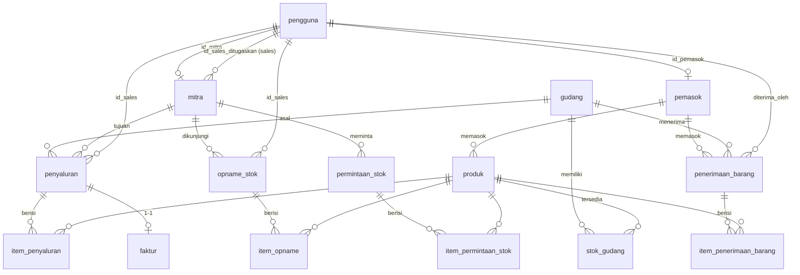

# 03 — Basis Data

Database menggunakan **MySQL / MariaDB** dengan **Drizzle ORM**. Skema didefinisikan di `server/database/schema/` (TypeScript), dan migration SQL-nya ada di `server/database/migrations/`.

## Ringkasan Tabel

Terdapat **15 tabel**:

| # | Tabel | Fungsi |
|:--|:------|:-------|
| 1 | `pengguna` | Akun pengguna + role |
| 2 | `pemasok` | Data pemasok/supplier |
| 3 | `produk` | Katalog produk |
| 4 | `gudang` | Lokasi gudang |
| 5 | `mitra` | Toko/partner titip jual |
| 6 | `stok_gudang` | Saldo stok per produk per gudang |
| 7 | `penerimaan_barang` | Header barang masuk (GR) |
| 8 | `item_penerimaan_barang` | Rincian item GR |
| 9 | `penyaluran` | Header penyaluran (DEL) |
| 10 | `item_penyaluran` | Rincian item DEL |
| 11 | `faktur` | Faktur titip jual |
| 12 | `opname_stok` | Header opname |
| 13 | `item_opname` | Rincian item opname |
| 14 | `permintaan_stok` | Header permintaan restok |
| 15 | `item_permintaan_stok` | Rincian item restok |

## Diagram Relasi (ERD)

## Detail Tabel

### `pengguna` — Akun Pengguna

| Kolom | Tipe | Keterangan |
|:------|:-----|:-----------|
| `id` | bigint (PK, AI) | ID |
| `nama` | varchar(100) | Nama lengkap |
| `email` | varchar(150) | Email (unik) |
| `password_hash` | varchar(255) | Hash password (bcrypt) |
| `peran` | enum | `penyalur` · `sales` · `mitra` · `pemasok` |
| `id_mitra` | bigint (FK → mitra.id) | Terisi jika peran `mitra` |
| `id_pemasok` | bigint (FK → pemasok.id) | Terisi jika peran `pemasok` |
| `apakah_aktif` | tinyint | 1 = aktif, 0 = nonaktif |

### `pemasok` — Pemasok

| Kolom | Tipe | Keterangan |
|:------|:-----|:-----------|
| `id` | bigint (PK, AI) | ID |
| `nama` | varchar(100) | Nama pemasok |
| `kategori_merek` | varchar(100) | Kategori merek |
| `narahubung` | varchar(100) | Nama narahubung |
| `apakah_aktif` | tinyint | Status aktif |

### `produk` — Produk

| Kolom | Tipe | Keterangan |
|:------|:-----|:-----------|
| `id` | bigint (PK, AI) | ID |
| `sku` | varchar(50) | Kode SKU (unik) |
| `nama` | varchar(150) | Nama produk |
| `id_pemasok` | bigint (FK → pemasok.id) | Pemasok |
| `satuan` | varchar(20) | Satuan (Botol, Kotak, dst.) |
| `harga_pabrik` | decimal(12,2) | Harga beli dari pabrik |
| `harga_grosir` | decimal(12,2) | Harga grosir/setor |
| `harga_retail` | decimal(12,2) | Harga retail/jual |
| `gambar` | text | URL gambar (opsional) |
| `apakah_aktif` | tinyint | Status aktif |

### `gudang` — Gudang

| Kolom | Tipe | Keterangan |
|:------|:-----|:-----------|
| `id` | bigint (PK, AI) | ID |
| `kode` | varchar(20) | Kode gudang (unik) |
| `nama` | varchar(100) | Nama gudang |
| `alamat` | text | Alamat |
| `apakah_aktif` | tinyint | Status aktif |

### `mitra` — Mitra / Toko

| Kolom | Tipe | Keterangan |
|:------|:-----|:-----------|
| `id` | bigint (PK, AI) | ID |
| `nama` | varchar(100) | Nama toko |
| `nama_pemilik` | varchar(100) | Nama pemilik |
| `telepon` | varchar(20) | Telepon |
| `alamat` | varchar(255) | Alamat |
| `lat` / `lng` | decimal | Koordinat (untuk peta) |
| `id_sales_ditugaskan` | bigint (FK → pengguna.id) | Sales yang ditugaskan |
| `apakah_aktif` | tinyint | Status aktif |

### `stok_gudang` — Stok per Gudang

| Kolom | Tipe | Keterangan |
|:------|:-----|:-----------|
| `id` | bigint (PK, AI) | ID |
| `id_gudang` | bigint (FK → gudang.id) | Gudang |
| `id_produk` | bigint (FK → produk.id) | Produk |
| `jumlah` | int | Saldo stok |
| `diperbarui_pada` | timestamp | Waktu update terakhir |

### `penerimaan_barang` — Header Penerimaan (GR)

| Kolom | Tipe | Keterangan |
|:------|:-----|:-----------|
| `id` | bigint (PK, AI) | ID |
| `nomor_penerimaan` | varchar(50) | Nomor dokumen (unik), format `GR-YYYYMMDD-XXXX` |
| `id_pemasok` | bigint (FK) | Pemasok |
| `id_gudang` | bigint (FK) | Gudang tujuan |
| `diterima_oleh` | bigint (FK → pengguna.id) | Petugas penerima |
| `tanggal_penerimaan` | date | Tanggal |
| `status` | enum | `draft` · `completed` |

### `item_penerimaan_barang` — Item GR

| Kolom | Tipe | Keterangan |
|:------|:-----|:-----------|
| `id` | bigint (PK, AI) | ID |
| `id_penerimaan` | bigint (FK) | Header GR |
| `id_produk` | bigint (FK) | Produk |
| `jumlah` | int | Jumlah diterima |
| `harga_pabrik_aktual` | decimal(12,2) | Harga pabrik aktual saat terima |

### `penyaluran` — Header Penyaluran (DEL)

| Kolom | Tipe | Keterangan |
|:------|:-----|:-----------|
| `id` | bigint (PK, AI) | ID |
| `nomor_penyaluran` | varchar(50) | Nomor dokumen (unik), format `DEL-YYYYMMDD-XXXX` |
| `id_gudang_asal` | bigint (FK → gudang.id) | Gudang asal |
| `id_mitra` | bigint (FK → mitra.id) | Mitra tujuan |
| `id_sales` | bigint (FK → pengguna.id) | Sales |
| `tanggal_penyaluran` | date | Tanggal kirim |
| `status` | enum | `draft` · `sent` · `received` |
| `dibuat_oleh` | bigint (FK → pengguna.id) | Pembuat dokumen |

### `item_penyaluran` — Item DEL

| Kolom | Tipe | Keterangan |
|:------|:-----|:-----------|
| `id` | bigint (PK, AI) | ID |
| `id_penyaluran` | bigint (FK) | Header DEL |
| `id_produk` | bigint (FK) | Produk |
| `jumlah_dikirim` | int | Jumlah dikirim |
| `snapshot_harga_retail` | decimal(12,2) | Snapshot harga retail saat kirim |
| `snapshot_harga_grosir` | decimal(12,2) | Snapshot harga grosir saat kirim |

> Harga disimpan sebagai *snapshot* agar faktur tetap akurat meskipun harga master produk berubah kemudian.

### `faktur` — Faktur Titip Jual

| Kolom | Tipe | Keterangan |
|:------|:-----|:-----------|
| `id` | bigint (PK, AI) | ID |
| `nomor_faktur` | varchar(50) | Nomor faktur (unik), format `INV-YYYY-XXXX` |
| `id_penyaluran` | bigint (FK → penyaluran.id) | Penyaluran terkait (relasi 1-1) |
| `total_nilai` | decimal(14,2) | Total nilai titip jual (retail) |
| `diterbitkan_pada` | timestamp | Waktu terbit |
| `url_pdf` | varchar(255) | URL file PDF (opsional) |

### `opname_stok` — Header Opname

| Kolom | Tipe | Keterangan |
|:------|:-----|:-----------|
| `id` | bigint (PK, AI) | ID |
| `nomor_opname` | varchar(50) | Nomor dokumen (unik), format `OP-YYYYMMDD-XXXX` |
| `id_mitra` | bigint (FK) | Mitra yang dikunjungi |
| `id_sales` | bigint (FK) | Sales |
| `tanggal_kunjungan` | date | Tanggal kunjungan |
| `status` | enum | `draft` · `submitted` · `verified` |
| `memiliki_anomali` | tinyint | Flag ada/tidak anomali |
| `dibuat_oleh` | bigint (FK) | Pembuat |

### `item_opname` — Item Opname

| Kolom | Tipe | Keterangan |
|:------|:-----|:-----------|
| `id` | bigint (PK, AI) | ID |
| `id_opname` | bigint (FK) | Header opname |
| `id_produk` | bigint (FK) | Produk |
| `stok_awal` | int | Stok awal titipan |
| `jumlah_laku` | int | Jumlah terjual |
| `jumlah_retur` | int | Jumlah retur |
| `hilang` | int | Jumlah hilang |
| `penanggung_hilang` | enum | `penyalur` · `mitra` (siapa menanggung) |
| `stok_fisik` | int | `stok_awal − laku − retur − hilang` |
| `kondisi_retur` | enum | `good` · `damaged` · `expired` |
| `apakah_anomali` | tinyint | Flag anomali |

### `permintaan_stok` — Permintaan Restok

| Kolom | Tipe | Keterangan |
|:------|:-----|:-----------|
| `id` | bigint (PK, AI) | ID |
| `nomor_permintaan` | varchar(50) | Nomor (unik), format `RR-YYYYMMDD-XXXX` |
| `id_mitra` | bigint (FK) | Mitra peminta |
| `diminta_oleh` | bigint (FK) | User yang meminta |
| `status` | enum | `pending` · `approved` · `rejected` · `fulfilled` |
| `disetujui_oleh` | bigint (FK) | User yang menyetujui |
| `id_penyaluran` | bigint (FK) | Penyaluran pemenuhan |

### `item_permintaan_stok` — Item Restok

| Kolom | Tipe | Keterangan |
|:------|:-----|:-----------|
| `id` | bigint (PK, AI) | ID |
| `id_permintaan` | bigint (FK) | Header permintaan |
| `id_produk` | bigint (FK) | Produk |
| `jumlah_diminta` | int | Jumlah diminta |
| `jumlah_disetujui` | int | Jumlah disetujui |

## Konvensi Penomoran Dokumen

| Jenis | Format | Contoh |
|:------|:-------|:-------|
| Penerimaan Barang | `GR-YYYYMMDD-XXXX` | `GR-20260601-0001` |
| Penyaluran | `DEL-YYYYMMDD-XXXX` | `DEL-20260604-0001` |
| Faktur | `INV-YYYY-XXXX` | `INV-2026-0011` |
| Opname | `OP-YYYYMMDD-XXXX` | `OP-20260610-0001` |
| Permintaan Stok | `RR-YYYYMMDD-XXXX` | `RR-20260608-0001` |
