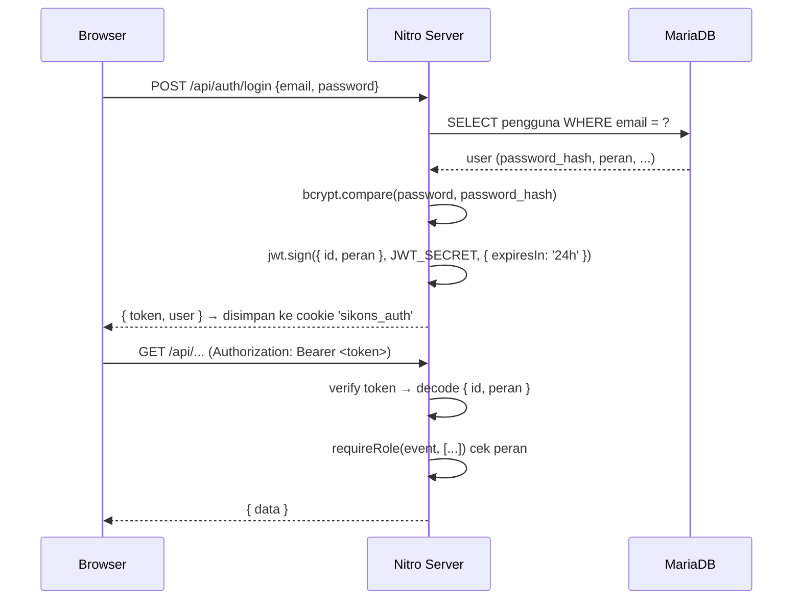

# 05 — Autentikasi & Hak Akses (RBAC)

## Mekanisme Autentikasi

Autentikasi menggunakan **JWT (JSON Web Token)** dengan password yang di-hash memakai **bcrypt**.

**Alur login:**

**Detail implementasi (di `server/utils/auth.ts`):**

| Fungsi | Keterangan |
|:-------|:-----------|
| `hashPassword(pw)` | `bcrypt.hash(pw, 10)` |
| `verifyPassword(pw, hash)` | `bcrypt.compare(...)` |
| `generateToken(payload)` | `jwt.sign(payload, JWT_SECRET, { expiresIn: '24h' })` |
| `verifyToken(token)` | `jwt.verify(token, JWT_SECRET)` |

- **Durasi token**: 24 jam.
- **Penyimpanan di klien**: cookie bernama `sikons_auth` (composable `useAuth`).
- **Pengiriman ulang**: composable `useApi` otomatis menambahkan header `Authorization: Bearer ***.
- **Guard server**: `server/middleware/auth.ts` memverifikasi token untuk seluruh endpoint `/api/*` (kecuali login).
- **Guard klien**: `middleware/auth.global.ts` mengarahkan pengguna yang belum login ke `/auth/login`.

## Role Pengguna

Ada **4 peran (role)**, tersimpan pada kolom `pengguna.peran`:

| Role | Nilai `peran` | Deskripsi | Catatan |
|:-----|:--------------|:----------|:--------|
| Penyalur (admin) | `penyalur` | Distributor/pengelola sistem | Akses penuh |
| Sales | `sales` | Petugas lapangan | Input opname & penerimaan |
| Mitra | `mitra` | Pemilik toko titip jual | Terhubung ke baris `mitra` via `id_mitra` |
| Pemasok | `pemasok` | Supplier barang | Terhubung ke `pemasok` via `id_pemasok` |

## Matriks Hak Akses

Implementasi RBAC memakai fungsi `requireRole(event, allowedRoles)` (di `server/utils/rbac.ts`). Role `penyalur` selalu lolos (akses penuh); role lain harus tercantum dalam daftar yang diizinkan.

| Kemampuan | penyalur | sales | mitra | pemasok |
|:----------|:--------:|:-----:|:-----:|:-------:|
| Lihat dashboard | ✅ | ✅ | ✅ | ✅ |
| Kelola data master (tambah/ubah/hapus) | ✅ | ❌ | ❌ | ❌ |
| Lihat data master | ✅ | ✅ | ✅ | ✅ (produk) |
| Buat penerimaan barang | ✅ | ✅ | ❌ | ❌ |
| Ubah/hapus penerimaan | ✅ | ❌ | ❌ | ❌ |
| Lihat detail penerimaan | ✅ | ✅ | ❌ | ✅ |
| Buat penyaluran | ✅ | ✅ | ❌ | ❌ |
| Lihat penyaluran | ✅ | ✅ | ✅ (milik sendiri) | ✅ (terkait) |
| Buat opname stok | ✅ | ✅ | ✅ | ❌ |
| Submit/update opname | ✅ | ✅ | ❌ | ❌ |
| Verifikasi opname | ✅ | ❌ | ❌ | ❌ |
| Lihat faktur | ✅ | ✅ | ✅ | ✅ |
| Rekonsiliasi penyalur | ✅ | ❌ | ❌ | ❌ |
| Rekonsiliasi mitra | ✅ | ❌ | ✅ (milik sendiri) | ❌ |
| Buat permintaan restok | ✅ | ❌ | ✅ | ❌ |
| Approve/fulfill restok | ✅ | ❌ | ❌ | ❌ |
| Kelola pengguna | ✅ | ❌ | ❌ | ❌ |

## Penyaringan Data per Role

Selain `requireRole`, beberapa endpoint melakukan **penyaringan data** berdasarkan role agar setiap pengguna hanya melihat data yang relevan:

- **Mitra** hanya melihat penyaluran/opname/faktur untuk mitranya sendiri (berdasarkan `pengguna.id_mitra`).
- **Pemasok** hanya melihat penerimaan/penyaluran yang terkait dengan pemasoknya (berdasarkan `pengguna.id_pemasok`).
- **Sales** melihat data sesuai penugasan (`mitra.id_sales_ditugaskan`).

## Menu Navigasi per Role

Sidebar (`components/AppSidebar.vue`) menampilkan menu berbeda berdasarkan `peran`:

| Menu | penyalur | sales | mitra | pemasok |
|:-----|:--------:|:-----:|:-----:|:-------:|
| Dashboard | ✅ | ✅ | ✅ | ✅ |
| Pemasok | ✅ | — | — | — |
| Produk | ✅ | ✅ | — | ✅ |
| Mitra | ✅ | ✅ | — | — |
| Gudang | ✅ | — | — | — |
| Pengguna | ✅ | — | — | — |
| Stok Gudang | ✅ | ✅ | — | — |
| Penerimaan | ✅ | — | — | ✅ |
| Penyaluran | ✅ | ✅ | ✅ | ✅ |
| Faktur | ✅ | — | ✅ | — |
| Opname | ✅ | ✅ | ✅ | — |
| Rekonsiliasi Penyalur | ✅ | — | — | — |
| Rekonsiliasi Mitra | — | — | ✅ | — |

> Catatan: modul **Permintaan Stok (Restok)** ada di kode (`pages/permintaan-stok`) tetapi entri menunya dikomentari di sidebar, sehingga tidak muncul pada rilis saat ini.

## Manajemen Sesi

- Token JWT **tanpa state** (stateless) — server tidak menyimpan sesi; validitas ditentukan oleh signature + masa berlaku token.
- Logout dilakukan di sisi klien dengan menghapus cookie `sikons_auth`.
- Tidak ada refresh token; pengguna harus login ulang setelah token kedaluwarsa (24 jam).
